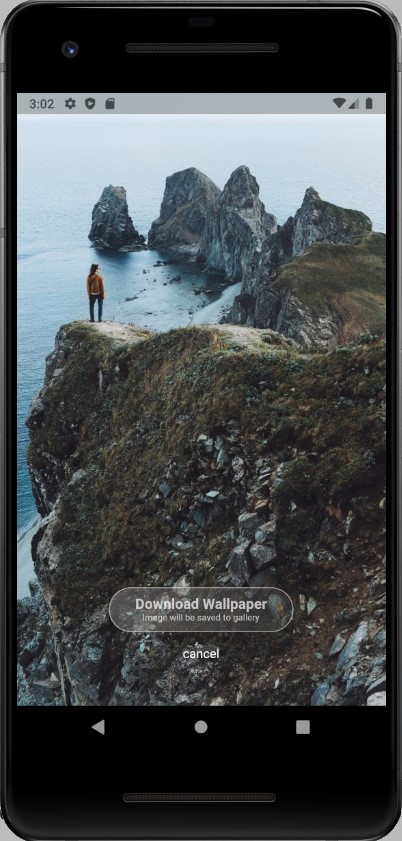

# **LatestNews** 
#### *An App to get Trending Free Hd Wallpapers For Mobile*  
   


## Table of Contents
- [**LatestNews**](#latestnews)
     
  - [Table of Contents](#table-of-contents)
  - [Download App](#down)
  - [About](#about)
  - [ScreenShots](#screenshots)
  - [Installation Prerequisites](#installation-prerequisites)
  - [How to Run this Project](#how-to-run-this-project)
     


## About
This app gets latest Trending Hd Wallpapers. Api used for this project is Pexels ( [API Link](https://www.pexels.com/api/)). This app has different sections for different categories of news like Wildlife, Nature, City, etc.
 
</br>


## Download App
[Click here to download the apk](https://drive.google.com/file/d/1GfOgFOXXpERTTkNoQispeSr19gWLFhH6/view?usp=sharing) 


## Screenshots


Home Screen             |  News
:-------------------------:|:-------------------------:
  |  

</br>


## Installation Prerequisites
- Flutter Setup
>To Setup Flutter [Click this Link and follw the setups given](https://flutter.dev/docs/get-started/install).

</br>

---

## How to Run this Project
1. Clone this Repo to your Local Machine.
2. Setup the Flutter and follow the steps given in this. [Link](https://flutter.dev/docs/get-started/install)
3. Open The Terminal/CMD in the folder latestNews.
4. Open Android Studio and create an Android emulator.
5. Type ```Flutter run ``` in the terminal to run the App in emulator.


